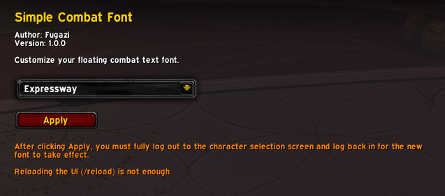

# Simple Combat Font

  
Swaps your floating combat text to the font of your choice.  

This addon does **not** change the _behaviour_ of the floating combat text.  
__It only changes the font__.

Currently supports:
- Blizzard default fonts
- LibSharedMedia fonts (fonts registered from other addons)

<small>Coming soon: use your own custom font</small>

## Installation
Extract SimpleCombatFont folder to `Interface\Addons\` folder

## Usage
1. Use `/scf` or open the Simple Combat Font panel in Game Menu > Options > Addons

2. Select a font from the drop-down list and click **Apply**

3. Log out to character select screen and log back in  

## Note
Your selection will be saved and applied each login. You only need to log out and log in when changing the font in the settings panel.

Due to the way WoW handles 3D font changes, you **must** log out to the character select screen, and log back in to apply this font change.  

## Planned
- [x] ~~Select from available LibSharedMedia fonts~~
- [ ] Use custom font via manual path

That's it, pretty simple